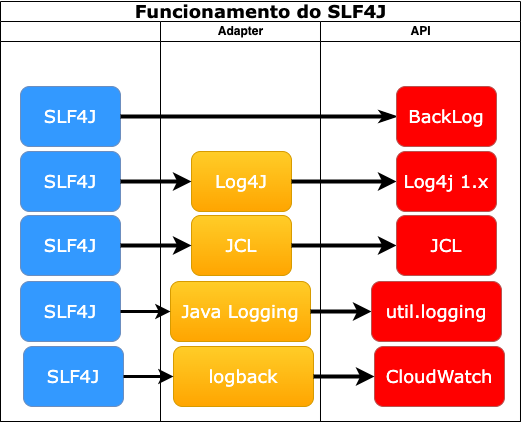
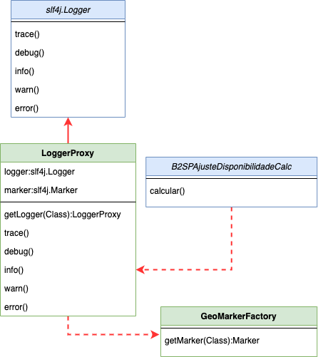

# LOGGER

## Logback
Logback é uma estrutura de registro para aplicativos Java, criada como sucessora do popular projeto log4j. Na verdade, essas duas estruturas foram criadas pelo mesmo desenvolvedor. Existem várias razões pelas quais Logback é uma ótima escolha para uma estrutura de registro.

### Porque que devemos alterar o System.out para Logback?
Iremos remover o System.out para desbloquiar escrita das requisições dele ao console ao gravar o evento. Com isso, além de aumentar o desempenho do sistema, também permitirá avançar em escrever diferentes layouts (
ex. adicionar, informações necessárias de rastreabilidade e observabilidade), em várias saídas (ex. console, arquivo (xml, html, txt, ...), mensageria), ao mesmo tempo, em momentos diferenciados ou baseado em regras.
Outra necessidade será na evolução de diferentes saídas para os diferentes ambientes, ou seja, no ambiente do desenvolver, pode-se optar somente por saída em console, no ambiente de qualidade em console e arquivo, 
em produção somente em AWS CloudWatch. Em AWS CloudWatch estariamos centralizando todos logs em um único local, facilitando a busca por problemas, permitindo criar alertas e tomar ações antes de algum desgaste com o usuário.

### Como configurar o Logback
Toda configuração dos Appenders e Layout pode-se realizada no arquivo logback.xml ou criar customizações para tal. Para mais informações [logback](https://logback.qos.ch/manual/configuration.html)
Também foi utilizado o MDC (Mapped Diagnostic Context) para adicionar informação do cliente do qual está realizando o log. Essa informação é necessária para rastrear ambientes compartilhados e distinquir de onde partiu 
o registro do mesmo. Para um tratamento mais elegante, ao invés de adicionar essa informação estaticamente ao código java, melhor utilizar uma variável de ambiente que determina qual é o cliente em questão.

## Padrões de Projeto

### Facade
Ele oculta toda a complexidade de uma ou mais classes através de uma Facade (Fachada). A intenção desse Padrão de Projeto é simplificar uma interface.
Nesse projeto utilizamos o SLF4J. Ele é um facade com vários frameworks de logging. Ele abstraí e torna mais simples alterar implementações de log futuramente no projeto. É uma biblioteca bastante estável e ativamente utilizada
por vários tipos de serviços/sistemas, tal como Apache Cammer, ActiveMQ, Solr, EhCache, dentre outros.
Para inicialização tratamento dos logs, inicializamos com o Logback, o qual é o sucessor do Log4J. Ele suporta Markers, ou seja, tags com os statements de logs. Pode adicionar vários tipos de appenders para tomar decisões na 
presença ou ausência deles. Neste exemplo, foi utilizado para informar o contexto do qual está sendo geraod o Log. Outra vantagem de se usar o Facade é facilitar a manutenção de acoplamentos
de terceiros.

### Proxy 
O Pattern Proxy é um padrão Estrutural definido pelo GoF (Gang of Four). O seu objetivo principal é encapsular um objeto através de um outro objeto que possui a mesma interface, de forma que o segundo objeto, conhecido como “Proxy”, controla o acesso ao primeiro, que é o objeto real.
A classe para realizar esse comportamento é a LoggerProxy. Apesar de não estar seguindo a risca o pattern, devido a não existir necessidade de implementar todos métodos da interface Logger, ele consegue realizar o objetivo proposta,
do qual, ao invés de ficar passando o Marker a todo log que deseja realizar, basta chamar o log com o nível desejado que o Marker correto será designado.

### Factory
O Factory method é um padrão de projeto criacional, que resolve o problema de criar objetos sem especificar suas classes concretas.
A classe que utiliza desse padrão á a GeoMarkerFactory. O objetivo dela é designar o Marker correto para o contexto de log. Isso permite identificar de forma mais rápida em qual funcionalidade gerou a escrita no log.

